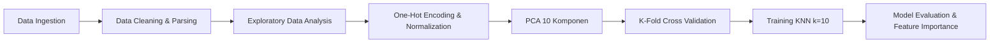

# Prediksi Tingkat Kemiskinan di Indonesia Menggunakan Algoritma K-Nearest Neighbors (KNN)

[](https://www.kaggle.com/code/faisaldinobahtiar/prediksi-tingkat-kemiskinan-dengan-knn)
[](https://www.python.org/)
[](https://scikit-learn.org/)

---

## 📌 Tentang Repositori Ini

Repository ini merupakan dokumentasi kode dari proyek analisis data dan machine learning yang sebelumnya telah saya buat dan publikasikan di **Kaggle 2 tahun yang lalu**:
🔗 **Kaggle Notebook**: [Prediksi Tingkat kemiskinan Dengan Knn](https://www.kaggle.com/code/faisaldinobahtiar/prediksi-tingkat-kemiskinan-dengan-knn)

Setelah mendapatkan sambutan dan apresiasi di komunitas Kaggle, sekarang kode, dataset, dan implementasi lengkapnya resmi saya unggah dan arsipkan ke GitHub agar lebih terstruktur, mudah diakses untuk riset atau kolaborasi lebih lanjut, serta dapat dijalankan baik via Jupyter Notebook maupun executable script Python.

---

## 📖 Ringkasan Proyek

Kemiskinan merupakan salah satu isu pembangunan ekonomi dan sosial yang krusial di Indonesia. Penelitian ini bertujuan untuk mengklasifikasikan dan memprediksi status tingkat kemiskinan pada level **Kabupaten/Kota di seluruh Indonesia** berdasarkan berbagai indikator komposit kesejahteraan masyarakat (kesehatan, pendidikan, ekonomi, serta infrastruktur dasar).

Dengan menggunakan algoritma **K-Nearest Neighbors (KNN)** yang dioptimalkan melalui *Cross Validation* dan reduksi dimensi *Principal Component Analysis (PCA)*, model ini mampu mengidentifikasi daerah yang rentan terhadap kemiskinan secara akurat.

---

## 📊 Dataset & Variabel

Dataset bersumber dari Badan Pusat Statistik (BPS) yang dikurasi di Kaggle:
- **Dataset**: [Klasifikasi Tingkat Kemiskinan di Indonesia](https://www.kaggle.com/datasets/ermila/klasifikasi-tingkat-kemiskinan-di-indonesia)

### Fitur / Indikator yang Digunakan:
| No | Nama Fitur | Deskripsi |
|---|---|---|
| 1 | `Provinsi` | Wilayah provinsi tempat kabupaten/kota berada |
| 2 | `Kab/Kota` | Nama kabupaten atau kota |
| 3 | `Persentase_Miskin` | Persentase penduduk miskin (P0) menurut Kab/Kota (%) |
| 4 | `Rata2_Lama_Sekolah` | Rata-rata lama sekolah penduduk usia 15 tahun ke atas (Tahun) |
| 5 | `Pengeluaran_per_Kapita` | Pengeluaran riil per kapita per tahun yang disesuaikan (Ribu Rupiah) |
| 6 | `IPM` | Indeks Pembangunan Manusia |
| 7 | `Umur_Harapan_Hidup` | Angka harapan hidup saat lahir (Tahun) |
| 8 | `Akses_Sanitasi` | Persentase rumah tangga dengan akses sanitasi layak (%) |
| 9 | `Akses_Air_Minum` | Persentase rumah tangga dengan akses air minum layak (%) |
| 10 | `Tingkat_Pengangguran` | Tingkat Pengangguran Terbuka (TPT) (%) |
| 11 | `TPAK` | Tingkat Partisipasi Angkatan Kerja (%) |
| 12 | `PDRB` | Produk Domestik Regional Bruto atas dasar harga konstan menurut pengeluaran |
| 13 | `Klasifikasi_Kemiskinan` | **Target Variabel**: `0` = Tidak Miskin, `1` = Miskin |

---

## 🔬 Alur Kerja & Metodologi Analisis



### 1. Data Cleaning & Preprocessing
- Mengubah format separator desimal dari koma (`,`) menjadi titik (`.`) dan mengonversi kolom numerik ke tipe data `float`.
- Menangani nilai yang hilang (*missing values*) dengan membuang baris kosong sehingga diperoleh 514 kabupaten/kota yang valid.
- Melakukan **One-Hot Encoding** pada fitur kategorikal wilayah (`Provinsi`).
- Normalisasi rentang fitur numerik menggunakan **MinMaxScaler** agar perhitungan jarak Euclidean pada KNN seimbang dan tidak didominasi variabel berskala besar.
- Menerapkan **PCA (Principal Component Analysis)** dengan `n_components=10` untuk mereduksi dimensionalitas sekaligus mempertahankan varians data penting.

### 2. Exploratory Data Analysis (EDA) & Temuan Utama
- **Korelasi Negatif Signifikan**: Persentase Kemiskinan berkorelasi negatif kuat dengan `IPM` (-0.74), `Pengeluaran per Kapita` (-0.67), dan `Akses Sanitasi` (-0.61). Artinya, daerah dengan indeks pembangunan manusia dan akses fasilitas dasar yang baik memiliki persentase kemiskinan yang jauh lebih rendah.
- **Peran Pendidikan**: `Rata-rata Lama Sekolah` berkorelasi positif sangat kuat dengan `IPM` (0.85), mempertegas bahwa pendidikan adalah pilar utama kemajuan kualitas hidup masyarakat.
- **Kapasitas Ekonomi Daerah**: `Pengeluaran per Kapita` dan `PDRB` memiliki korelasi 0.78, mencerminkan sinergi antara output ekonomi makro dan daya beli riil per kapita.

### 3. Hyperparameter Tuning & Training
- Membagi data dengan **Stratified Train-Test Split (80% Train : 20% Test)** untuk menjaga proporsi kelas target tetap seimbang.
- Menguji nilai tetangga terdekat ($k$) pada rentang $k = 1 \dots 20$ dengan **Cross-Validation**.
- Diperoleh nilai optimal pada **$k = 10$**.

---

## 📈 Hasil Evaluasi Model

Pengujian pada data uji (*test set*) menunjukkan performa model:

| Metrik Evaluasi | Hasil |
|---|---|
| **Akurasi** | **94.17% - 95.15%** |
| **Precision** | **75.00% - 76.92%** |
| **Recall** | **75.00% - 83.33%** |
| **F1-Score** | **75.00% - 80.00%** |
| **ROC AUC** | **85.85% - 90.02%** |

Model memiliki kemampuan generalisasi yang sangat baik dalam mengenali pola wilayah miskin dan non-miskin dengan keseimbangan skor *precision* dan *recall*.

### 🔍 Variabel Paling Berpengaruh (Feature Importance):
Berdasarkan analisis bobot penting variabel:
1. **Persentase Kemiskinan Daerah** (25.47%)
2. **Pengeluaran per Kapita** (9.82%)
3. **PDRB Daerah** (8.84%)
4. **Indeks Pembangunan Manusia (IPM)** (7.75%)
5. **Umur Harapan Hidup** (4.63%)
6. **Faktor Geografis / Provinsi Tertentu** (4.46%)
7. **Rata-rata Lama Sekolah** (4.25%)
8. **Akses Sanitasi Layak** (3.89%)
9. **Tingkat Pengangguran Terbuka** (3.50%)
10. **Tingkat Partisipasi Angkatan Kerja (TPAK)** (3.22%)

---

## 📁 Struktur Repositori

```text
prediksi-kemiskinan-dengan-knn/
│
├── data/
│   └── Klasifikasi Tingkat Kemiskinan di Indonesia.csv   # Dataset CSV dari BPS / Kaggle
├── prediksi-tingkat-kemiskinan-dengan-knn.ipynb          # Jupyter Notebook interaktif
├── main.py                                               # Script Python standalone
├── requirements.txt                                      # Dependensi library
├── .gitignore                                            # Konfigurasi Git ignore
└── README.md                                             # Dokumentasi proyek
```

---

## 💻 Panduan Menjalankan Proyek

### 1. Clone Repositori
```bash
git clone https://github.com/vizca808/prediksi-kemiskinan-dengan-knn.git
cd prediksi-kemiskinan-dengan-knn
```

### 2. Setup Virtual Environment (Opsional)
```bash
python -m venv venv
# Windows:
venv\Scripts\activate
# Linux/macOS:
source venv/bin/activate
```

### 3. Install Dependensi
```bash
pip install -r requirements.txt
```

### 4. Eksekusi
- **Jupyter Notebook**:
  ```bash
  jupyter notebook prediksi-tingkat-kemiskinan-dengan-knn.ipynb
  ```
- **Python Script Langsung**:
  ```bash
  python main.py
  ```

---

## 👤 Author

- **Faisal Dino Bahtiar**
- Kaggle: [@faisaldinobahtiar](https://www.kaggle.com/faisaldinobahtiar)
- GitHub: [@vizca808](https://github.com/vizca808)
